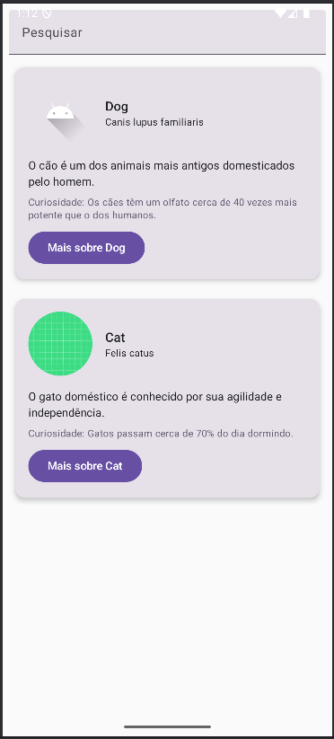
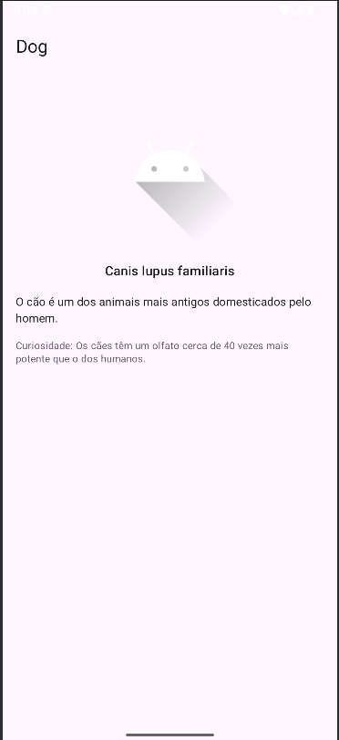
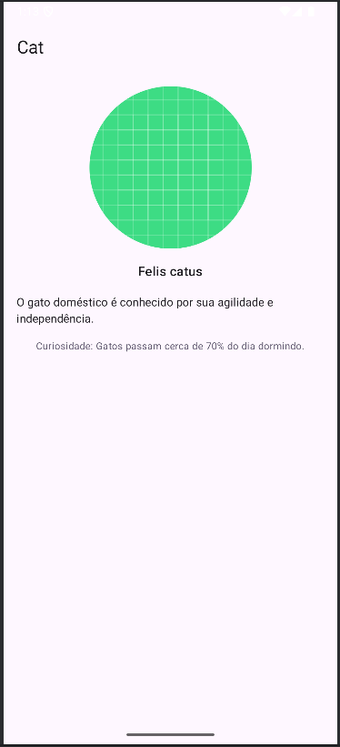

# 🐾 Aplicativo de Animais - Atividade de Desenvolvimento Mobile

Este é um aplicativo simples desenvolvido como atividade da disciplina de **Desenvolvimento Mobile**. Ele apresenta informações básicas sobre animais domésticos, com foco em design limpo, uso de imagens e navegação entre telas.

## ✨ Funcionalidades

* Lista de animais com nome popular, nome científico e curiosidades.
* Navegação para detalhes de cada animal.
* Imagens ilustrativas para cada animal.
* Campo de pesquisa (não funcional nesta versão, apenas visual).

## 📱 Capturas de Tela

### 🔍 Tela Principal - Lista de Animais

### 🐶 Tela de Detalhes - Cão

### 🐱 Tela de Detalhes - Gato

## 🛠️ Tecnologias Utilizadas

* **Kotlin**
* **Jetpack Compose**
* **Android Studio**

## 🎓 Sobre a Atividade

Esta aplicação foi desenvolvida com o objetivo de praticar os seguintes conceitos:

* Estruturação de interface com Jetpack Compose
* Utilização de `LazyColumn` para listas
* Componentização de elementos da UI
* Navegação entre telas com parâmetros

---

> Projeto desenvolvido como parte da disciplina de Desenvolvimento Mobile – Universidade Federal do Ceará, Campus Quixadá.

---